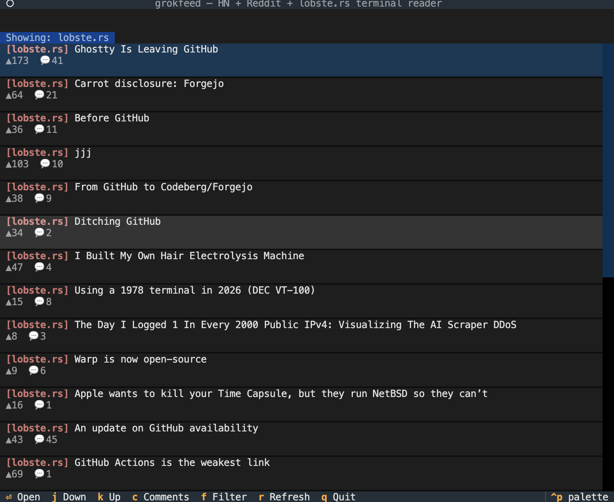
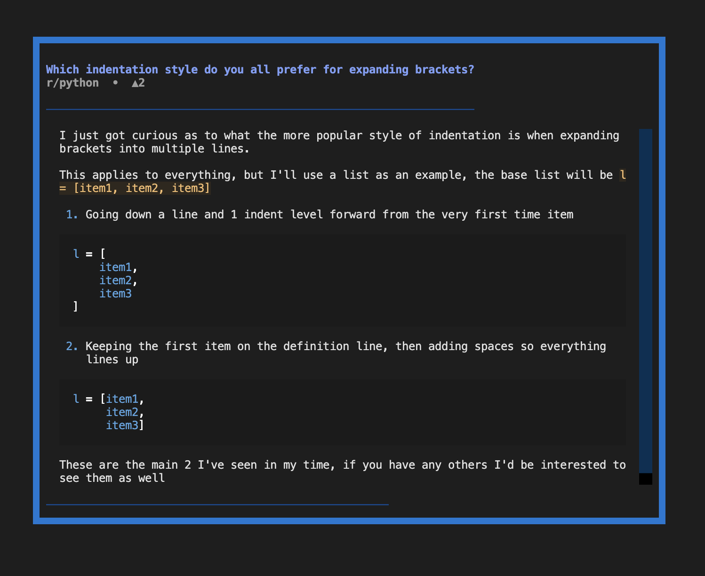
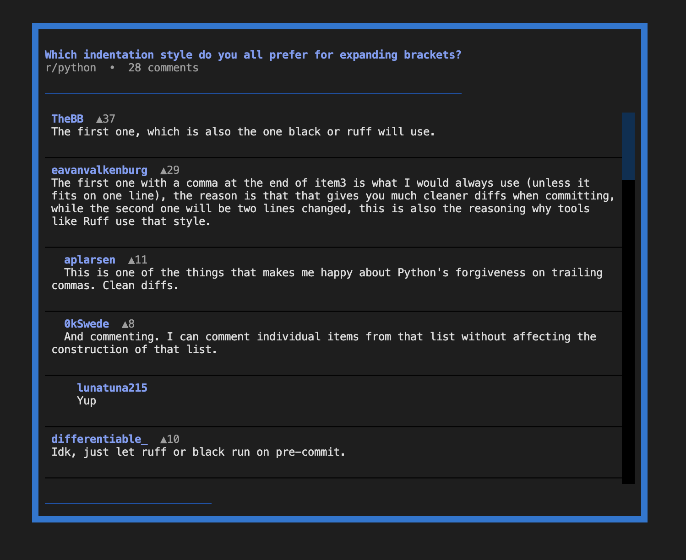

# grokfeed

Terminal feed reader for Hacker News, Reddit, and lobste.rs.


## Features

- Unified scrollable feed from HN, Reddit subreddits, and lobste.rs
- Color-coded by source: HN orange, lobste.rs red, subreddits in a cycling palette
- Read text posts and Ask HN inline — no browser needed
- Comments viewer with nested replies (up to 2 levels)
- Filter feed by source, refresh on demand
- Config file at `~/.grokfeed/config.toml` — created automatically on first run

## Install

Requires Python 3.11+. Recommended: use [uv](https://github.com/astral-sh/uv).

```bash
# with uv
uv venv --python 3.13 .venv
source .venv/bin/activate
uv pip install -e .

# or plain pip (Python 3.11+)
pip install -e .
```

## Run

```bash
grokfeed
```

## Screenshots







## Key bindings

### Main feed

| Key | Action |
|-----|--------|
| `j` / `↓` | Move down |
| `k` / `↑` | Move up |
| `Enter` | Open post body (text posts) or URL in browser (link posts) |
| `c` | Open comments |
| `f` | Cycle source filter (All → HN → r/sub → lobste.rs → …) |
| `r` | Refresh all sources |
| `q` | Quit |

### Post body modal

| Key | Action |
|-----|--------|
| `j` / `↓` | Scroll down |
| `k` / `↑` | Scroll up |
| `c` | Open comments for this post |
| `o` | Open URL in browser |
| `q` / `Esc` | Close |

### Comments modal

| Key | Action |
|-----|--------|
| `j` / `↓` | Scroll down |
| `k` / `↑` | Scroll up |
| `q` / `Esc` | Close |

## Config

`~/.grokfeed/config.toml` — created on first run with defaults.

```toml
subreddits = ["programming", "python", "machinelearning"]
hn_story_count = 30
reddit_post_count = 15
lobsters_post_count = 25
```

Edit to add or remove subreddits. Changes take effect on next launch or `r` refresh.

## Tech stack

| Library | Role |
|---------|------|
| [Textual](https://github.com/Textualize/textual) | TUI framework |
| [httpx](https://www.python-httpx.org/) | Async HTTP client |
| [Typer](https://typer.tiangolo.com/) | CLI entry point |
| [Rich](https://github.com/Textualize/rich) | Text rendering |
