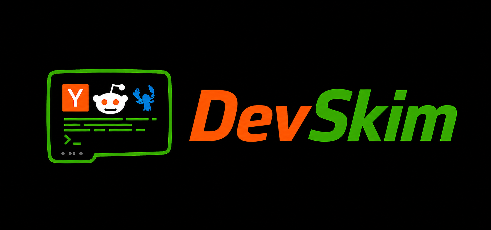

<div align="center">




**Terminal feed reader for Hacker News, Reddit, lobste.rs, and GitHub Trending.**

[](https://opensource.org/licenses/MIT)
[](https://pypi.org/project/devskim/)
[](https://pypi.org/project/devskim/)
[](https://github.com/emarkou/devskim/releases/latest)
[](https://github.com/emarkou/devskim/actions/workflows/ci.yml)
[](https://codecov.io/gh/emarkou/devskim)

</div>

## Features

- Unified scrollable feed from HN, Reddit subreddits, lobste.rs, and GitHub Trending
- Color-coded by source: HN orange, lobste.rs red, GitHub green, subreddits in a cycling palette
- Read text posts and Ask HN inline — no browser needed
- Split view with post body / repo stats and threaded comments or README side by side
- Filter feed by source, refresh on demand, paginate with `m`
- Keyword search with `/`, copy URL with `y`, mark seen posts dimmed automatically
- Config file at `${XDG_CONFIG_HOME:-~/.config}/devskim/config.toml` — created automatically on first run

## Install

### Homebrew (macOS/Linux)

```bash
brew tap emarkou/devskim
brew install devskim
```

### pip

```bash
pip install devskim
```

### pipx (isolated install)

```bash
pipx install devskim
```

### From source

Requires Python 3.11+.

```bash
git clone https://github.com/emarkou/devskim.git
cd devskim
pip install -e .
```

---

On first run, a config file is created at `$XDG_CONFIG_HOME/devskim/config.toml` (defaults to `~/.config/devskim/config.toml`). Edit it to change subreddits:

```bash
nano "${XDG_CONFIG_HOME:-~/.config}/devskim/config.toml"
```

```toml
subreddits = ["programming", "ClaudeAI", "machinelearning"]
hn_story_count = 30
reddit_post_count = 15
lobsters_post_count = 25
github_trending_count = 25
# github_trending_language = "python"   # filter by language (optional)
# github_trending_since = "daily"       # daily | weekly | monthly
cache_ttl_minutes = 10
```

Run `devskim` — changes take effect on next launch or press `r` to refresh.

## Demo


## Key bindings

### Main feed

| Key | Action |
|-----|--------|
| `j` / `↓` | Move down |
| `k` / `↑` | Move up |
| `Enter` | Open post + comments split view |
| `f` | Cycle source filter (All → HN → r/sub → lobste.rs → GitHub → …) |
| `m` | Load more stories |
| `r` | Refresh all sources |
| `y` | Copy story URL to clipboard |
| `/` | Keyword search |
| `q` | Quit |

### Split view

| Key | Action |
|-----|--------|
| `j` / `↓` | Scroll down |
| `k` / `↑` | Scroll up |
| `Tab` | Switch between post/stats and comments/README pane |
| `o` | Open URL in browser |
| `q` / `Esc` | Close |

## Config

`$XDG_CONFIG_HOME/devskim/config.toml` (default: `~/.config/devskim/config.toml`) — created on first run with defaults. If `~/.devskim` exists and the XDG path does not, the legacy location is used automatically.

| Key | Default | Description |
|-----|---------|-------------|
| `subreddits` | `["programming", "python", "machinelearning"]` | Subreddits to include |
| `hn_story_count` | `30` | HN stories per fetch |
| `reddit_post_count` | `15` | Posts per subreddit per fetch |
| `lobsters_post_count` | `25` | lobste.rs posts per fetch |
| `github_trending_count` | `25` | GitHub trending repos per fetch |
| `github_trending_language` | `""` | Filter by language (e.g. `"python"`), empty = all |
| `github_trending_since` | `"daily"` | Trending window: `daily`, `weekly`, or `monthly` |
| `cache_ttl_minutes` | `10` | Minutes before refreshing cache |

## Tech stack

| Library | Role |
|---------|------|
| [Textual](https://github.com/Textualize/textual) | TUI framework |
| [httpx](https://www.python-httpx.org/) | Async HTTP client |
| [Click](https://click.palletsprojects.com/) | CLI entry point |

---
Related posts: 
- https://dev.to/elemar/building-a-terminal-feed-reader-for-hacker-news-reddit-and-lobsters-with-python-textual-2alf
